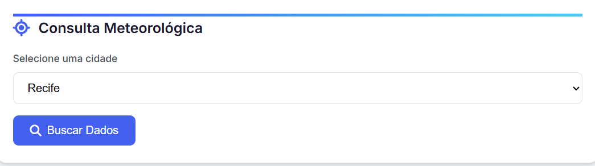
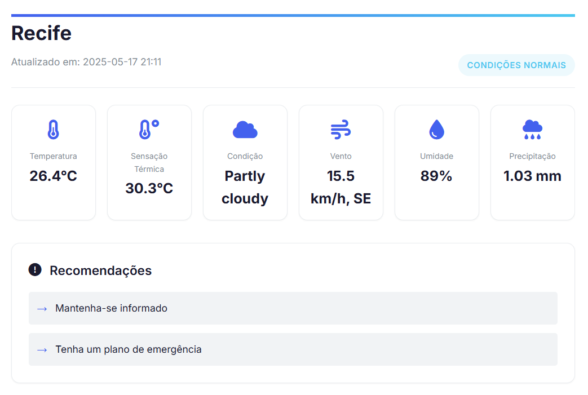
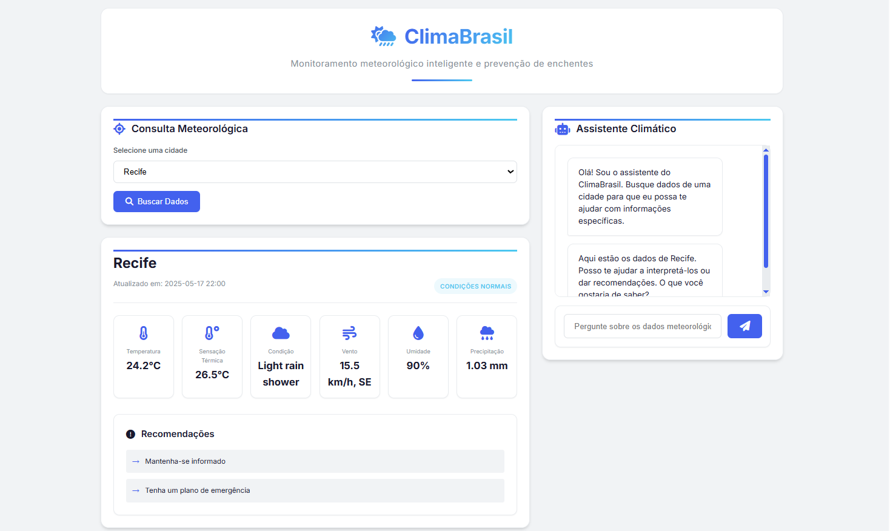

# ClimaBrasil - Sistema de Monitoramento de Riscos Climáticos

<div align="center">
  
  <h3>Solução tecnológica para prevenção de desastres climáticos</h3>
</div>

## 🌟 Impacto Social

O ClimaBrasil foi desenvolvido para ajudar a população brasileira a enfrentar os crescentes desafios climáticos, especialmente enchentes e deslizamentos que afetam diversas regiões do país.

**Benefícios oferecidos:**

- 🌐 Acesso democrático a tecnologia meteorológica

**Benefícios a ser implementados**

- 🚨 Alertas preventivos para comunidades em áreas de risco
- 📱 Informações acessíveis sobre condições climáticas perigosas
- 🆘 Orientação prática para situações de emergência
- 🏙️ Conscientização sobre riscos específicos por região

## 📌 Visão Geral

O ClimaBrasil é uma aplicação web que fornece:

- Informações meteologia em tempo real
- Integração com APIs de previsão do tempo
- Inteligência Artificial para orientações personalizadas

## ✨ Funcionalidades Principais

| Funcionalidade              | Descrição                                             |
| --------------------------- | ----------------------------------------------------- |
| Monitoramento em Tempo Real | Consulta contínua de dados meteorológicos atualizados |
| Chatbot Inteligente         | Assistente virtual com Gemini AI para tirar dúvidas   |
| Interface Responsiva        | Acessível em dispositivos móveis e desktops           |

## 🛠 Tecnologias Utilizadas

**Backend:**

- Python 3.8+
- Flask

**Frontend:**

- HTML5
- CSS3
- JavaScript (ES6+)

**APIs e Serviços:**

- WeatherAPI (dados meteorológicos)
- Google Gemini (IA generativa)

**Ferramentas:**

- Git (controle de versão)
- Pip (gerenciamento de pacotes)
- Python-dotenv (variáveis de ambiente)

## 🔧 Configuração do Ambiente

### Pré-requisitos

- Python 3.8 ou superior
- Conta na [WeatherAPI](https://www.weatherapi.com/)
- Chave de API do [Google Gemini](https://ai.google.dev/)

### 🔑 Obtenção das Chaves de API

**WeatherAPI:**

1. Acesse [weatherapi.com](https://www.weatherapi.com/)
2. Clique em "Sign Up" (cadastro gratuito disponível)
3. Encontre sua chave no dashboard após login

**Google Gemini:**

1. Acesse [Google AI Studio](https://aistudio.google.com/)
2. Faça login com conta Google
3. Crie uma nova chave na seção de API

### 🚀 Instalação

```bash
# Clone o repositório
git clone https://github.com/seu-usuario/climabrasil.git
cd climabrasil

# Crie e ative o ambiente virtual
python -m venv venv
source venv/bin/activate  # Linux/Mac
.\venv\Scripts\activate   # Windows

# Instale as dependências
pip install -r requirements.txt

# Configure as variáveis de ambiente
echo "WEATHER_API_KEY=sua_chave" > .env
echo "GOOGLE_API_KEY=sua_chave" >> .env

# Execute a aplicação
flask run
```

## Partes do projeto

<div align="center">
  <h4>Parte do cabeçalho</h4>
  
</div>

<br>

<div align="center">
  <h4>Parte onde seleciona a cidade</h4>
  
</div>

<br>

<div align="center">
  <h4>Parte da consulta meteorológica da cidade escolhida</h4>
  
</div>

<br>

<div align="center">
  <h4>Parte da assistente climático utilizando o chat do Gemini</h4>
  
</div>

<br>

<div align="center">
  <h4>Página completa</h4>
  
</div>
